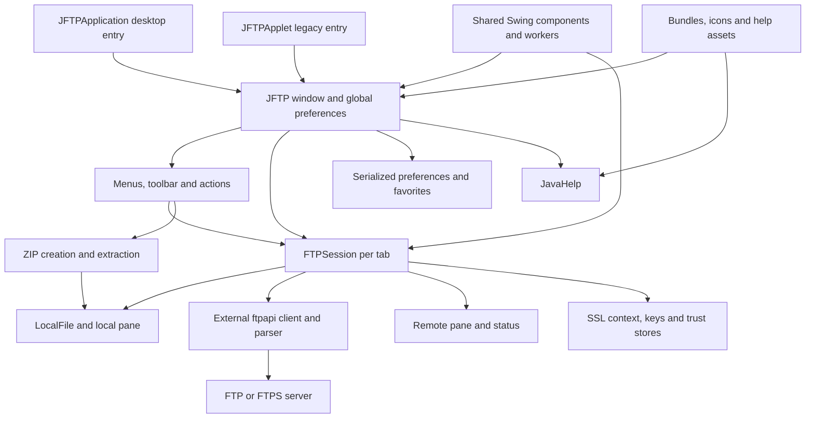

# JFTP documentation

This is the legacy-modernization exercise for Signity's four-day remote Codex + GitHub Copilot course. Repository documentation is in English; chat explanations are in Polish.

This documentation describes the legacy application and the proposed modernization work on `Luna-subagents-modernization`. The initial review uses static source analysis by GPT-6 Luna subagents. No application build, launch, or behavioral tests have been executed in this phase.

## Shared architecture map

This diagram summarizes the delegated source findings. Detailed lifecycle, threading, storage, and dependency evidence is in the linked documents; the external FTP artifact's implementation has not been inspected or resolved.

## Documentation triggers

Open the relevant document when its topic affects the task; there is no mandatory full-document reading sequence.

| Open | When it helps |
|---|---|
| [Compact map](repo-map.md) | Find likely definitions and dependency hubs without loading full source. |
| [Complete map](repo-map-full.md), [JSON index](repo-map.json) | Find a file or declaration omitted from compact context, or inspect structured reference evidence. |
| [Map method](repo-map-method.md), [validation](repo-map-validation.md) | Regenerate/check/focus the map, change extraction/ranking, or understand what the scanner cannot prove. |
| [Modernization plan](modernization-plan.md) | Choose an authorized phase, resolve a prerequisite, check acceptance gates, plan commit boundaries, or configure fork/upstream synchronization. |
| [Build and dependencies](build-and-dependencies.md) | Resolve artifacts, select toolchain versions, diagnose build/startup, or change launchers/distribution. Dated local observations are evidence, not requirements for other contributors. |
| [Application architecture](application-architecture.md) | Change lifecycle, session ownership, platform entry points, or UI/background-work boundaries. |
| [Application workflows](application-workflows.md) | Define expected connection, transfer, file-operation, preference, or favorite behavior and restart compatibility. |
| [Shared components](shared-components.md) | Work on custom Swing components/workers, file monitoring, helper APIs, or archive behavior. |
| [Actions and security](actions-and-security.md) | Change action guards/dispatch, certificate stores, client identity, or interactive TLS trust decisions. |
| [Resources and help](resources-and-help.md) | Change locale bundles/encoding, icons, help IDs/topics, or resource paths. |
| [Behavioral test plan](behavioral-test-plan.md) | Establish characterization tests, choose isolated fixtures, or extend the four initial regression families. |

## Review coverage

- [Build and shared source review](review-build-shared.md).
- [Application source review](review-application.md).
- [Security and asset review](review-security-assets.md).
- [Combined repository review](repository-review.md): ownership, total coverage, and review limits.

These manifests identify reviewed text and inventoried binaries. Binary metadata does not demonstrate visual correctness or runtime packaging correctness. Existing untracked `micro` is outside the review.
